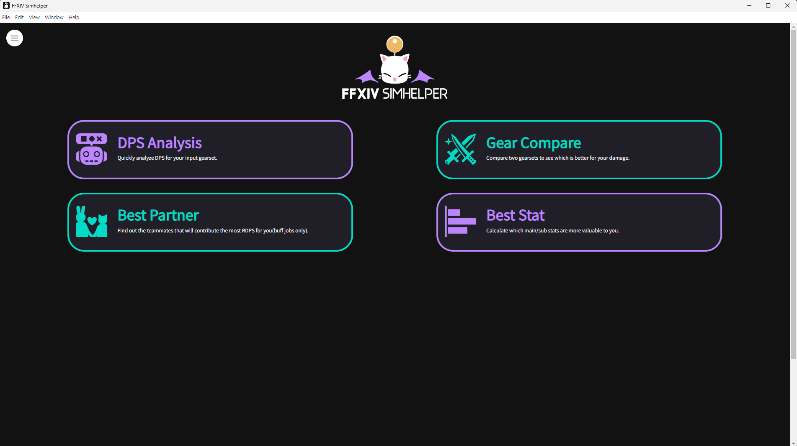
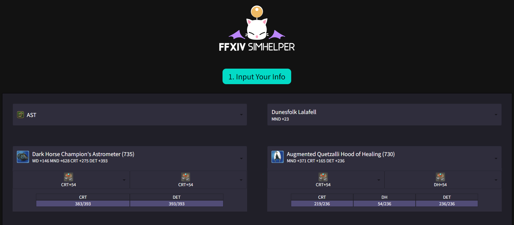
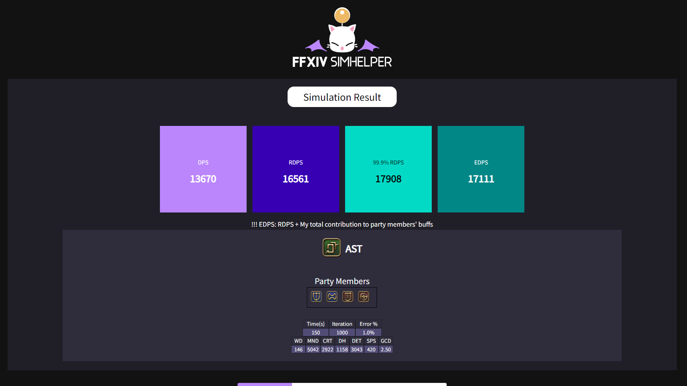
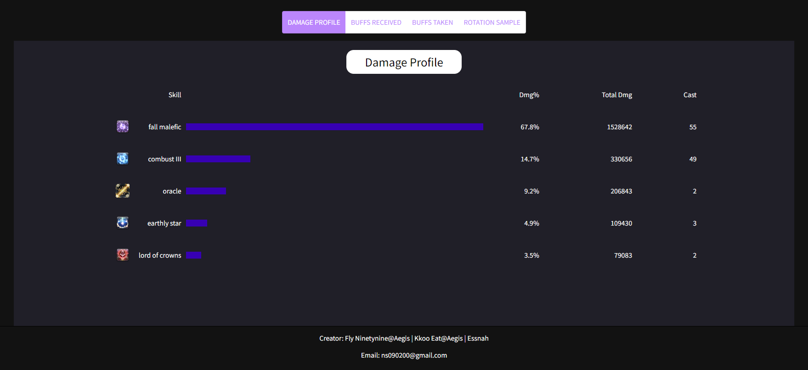
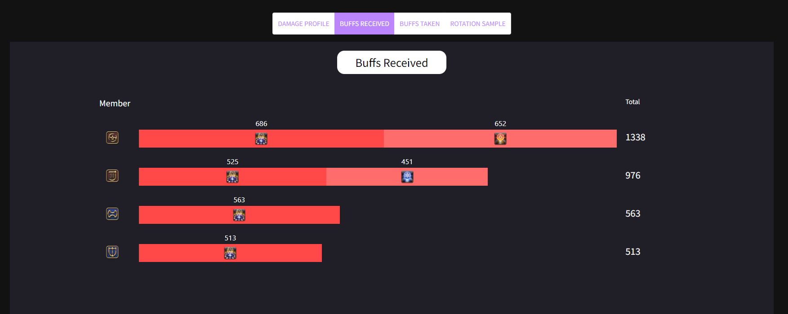
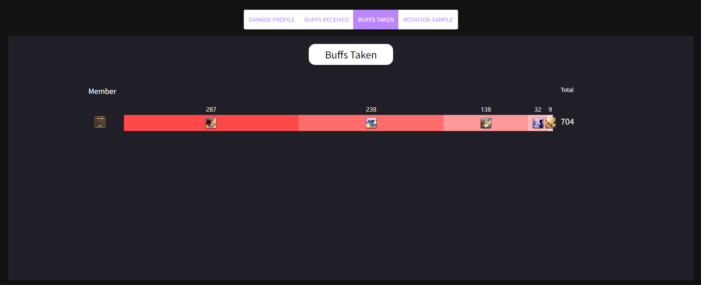
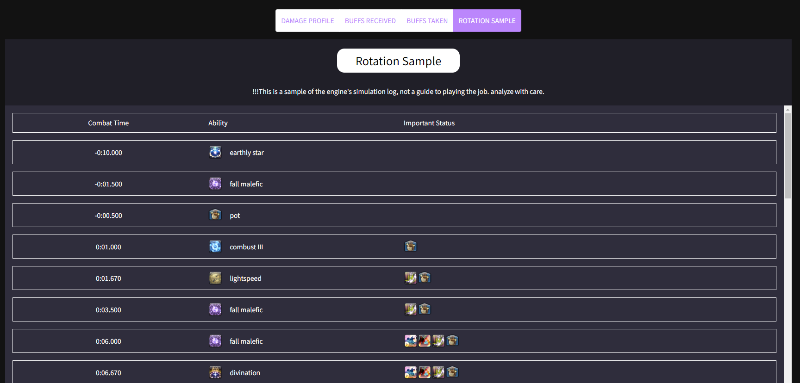
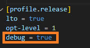

# FFXIV Simhelper

Simulation tool for FFXIV that simulates DPS in a party unit.




---



---



---



---




---




--- 


# How to install
1) [Demo server](https://www.ffxivsimhelper.com)
2) [app download(EN)]()

# Modules 

## 1. Etro Data Fetcher (Python)
Fetches etro equipment data and converts it to FFXIV Simhelper Equipment Data.

```shell
# in ffxiv_simhelper directory
# need python3 - requests

./setup_ffxiv_data.sh
```

## 2. FFXIV Simhelper Backend (Rust)
Rust Backend Server that does the DPS simulations.
* source codes
   * cmd: binaries for backend server/local server/profiling
   * lib: source files for the backend server

### 2-1. Run app backend server locally
```shell
# add --release if you want to build in release mode(about x5 faster than debug mode)

# build binary
cargo build --bin ffxiv-simhelper-local {--release}

# run 
cargo run --bin ffxiv-simhelper-local {--release}
```


### 2-2. Run backend server
* similar to local server, but supports https

```shell
# in linux OS
cargo run --bin ffxiv-simhelper --release
```


### 2-3. Run Profiler
* we first need to add ```debug = true``` in our root Cargo.toml file so that the profiler can track our function stacks and detect 



```shell
# install cargo flamegraph
cargo install flamegraph

# run dps analysis profiler
cargo flamegraph --bin profile-dpsanalysis

# run best stats profiler
cargo flamegraph --bin profile-beststats 
```


## 3. FFXIV Simhelper Frontend(App, React)
* Setting up environment

```shell
cd ffxiv-simhelper-app

# install yarn from npm
npm install yarn

# install app dependencies to yarn 
yarn install
```

### 3-1. Host local server for testing
```shell
# in ffxiv-simhelper-app directory
yarn dev
```


### 3-2. Build server 
* Require Linux OS
```shell
# in ffxiv-simhelper-app directory
yarn build-server
```

### 3-3. Build Electron App
* You need to have binary ```target/release/ffxiv-simhelper-local.exe``` built by the commands in ```### 2-1. Run app backend server locally``` 
```shell
# build and not publish. App is created in dist/ directory
yarn electron-pack

# build and publish to github 
$env:GH_TOKEN = "{token for ffxiv_simhelper_public}"
yarn electron-publish-release
```


## Guide
* Create Backend Server Documentation

